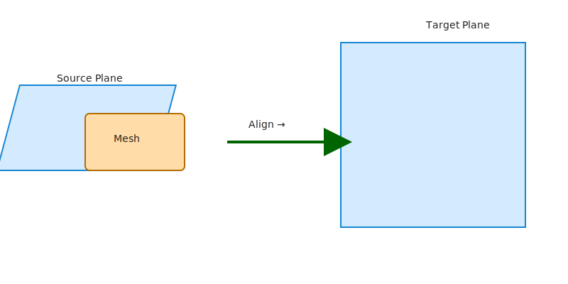

# Mesh Align Plugin for Fusion 360

A small Fusion 360 Python script to align mesh bodies to construction planes (single- or two-plane alignment) and optionally flip the mesh 180° around an in-plane axis. Includes detailed debug output to help diagnose transforms.

---

## Features

- Align a mesh body to a target construction plane (single-plane) or two target planes (constrained by intersection axis).
- Optional 180° flip about the in-plane `uDirection` axis of target Plane 1.
- Writes detailed debug info to `mesh_align_debug.txt` in the script folder when "Show Debug Info" is enabled.
- UI includes inputs for mesh, source/target plane pairs, and a Flip option. The Preview checkbox was intentionally commented out (can be re-enabled).

## Files

- `mesh_align_plugin.py` — main Fusion 360 script (place into Fusion Scripts/Addins or run from the Scripts & Add-Ins dialog).
- `mesh_align_debug.txt` — generated at runtime (in the same folder as the script) when "Show Debug Info" is enabled.

## Installation (Fusion 360)

1. Open Fusion 360.
2. Open `Tools` → `Add-Ins` → `Scripts and Add-Ins`.
3. Click `+` (Add) and select the folder containing `mesh_align_plugin.py`, or copy `mesh_align_plugin.py` into your local Fusion scripts folder.
4. Run the script from the Scripts & Add-Ins dialog. It will create a command entry named "Align Mesh to Planes" while running.

Note: Fusion 360's Python environment will report unresolved imports (e.g., `adsk.core`) in external editors — this is expected since those modules only exist inside Fusion.

## Usage

1. Run the script in Fusion 360.
2. A brief usage message will appear describing required prep:
   - Edit the mesh as needed using Direct Edit.
   - Create construction planes using "Plane Through 3 Points" on the mesh (create as many planes as needed).
3. In the dialog:
   - Select the Mesh Body.
   - Select Source Plane 1 (a plane built on/near the mesh you want to align).
   - Select Target Plane 1 (the destination plane in model space).
   - Optionally select Source/Target Plane 2 to constrain orientation with two planes.
   - Enable "Flip 180° on Plane 1" to apply the flip after alignment.
   - Enable "Show Debug Info" to write the debug file to the script folder.
4. Execute. The script will apply the alignment (and flip if requested). If debug is enabled, `mesh_align_debug.txt` will be saved alongside the script.

## Debug output

When "Show Debug Info" is enabled, the script writes a human-readable `mesh_align_debug.txt` file containing:

- Source and target plane origins, normals, uDirection, and computed vDirection.
- Intersection axes for the two-plane method.
- The computed transforms and predicted post-transform origins/normals.
- A final line indicating whether the flip move feature was applied.

This file is saved next to `mesh_align_plugin.py` (e.g., `c:\Users\<you>\mesh_align_plugin\mesh_align_debug.txt`).

## Troubleshooting & Notes

- If you don't visually see movement after the script runs:
  - Press Fit (F) to zoom to fit the scene — moved geometry can be offscreen.
  - Check the timeline for two recent Move features (alignment + flip). If present, the transform was applied.
  - Toggle visibility of the moved body or isolate it in the browser to force a refresh.
  - If the mesh is inside an occurrence/subcomponent, try switching the active component or apply occurrence transform mode (future option).
  - Enable "Show Debug Info" and inspect `mesh_align_debug.txt` for predicted post-transform positions.

- The script currently applies the flip as a second Move feature. If you prefer applying the transform to an occurrence's transform (instead of move features), that can be added as an option.

- A Preview checkbox was present but commented out; you can re-enable it in `mesh_align_plugin.py` if you want an interactive preview flow.

## Contributing

If you want enhancements, examples:

- Add a visible temporary helper (colored solid) to make flips obvious during testing.
- Add an "apply transform to occurrence" mode.
- Add UI for helper size/offset and preview behaviors.

Feel free to open issues / create PRs on the repository.

## License

MIT — copy or adapt with attribution.

---

If you'd like, I can also add a small example model or a minimal test harness and a short note on how to run the script from a command-line (for automated runs). Want that added to the README?

## Visual examples

Below are two simple illustrative diagrams (SVG) included in `assets/` to clarify the workflow.

Align example:

Flip demo (Before / After):

If you prefer real screenshots or an animated GIF, add your exported images to `assets/` with filenames `screenshot1.png`, `preview.gif`, etc., and the README will render them on GitHub.